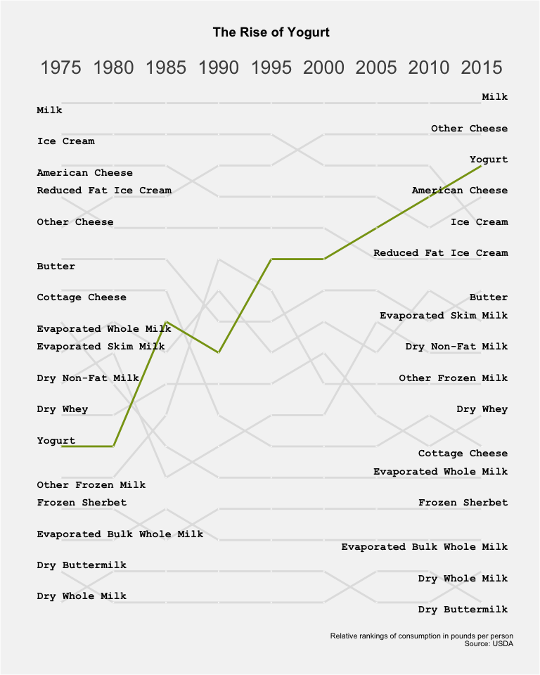

Tidy Tuesday 2019-01-29
================

Load data
---------

``` r
milk_products <- read_csv("milk_products_facts.csv")
```

Cleanup
-------

``` r
milk_products_tall <- 
  milk_products %>%
  gather(product, avg_consumption, -year) %>%
  mutate(product = case_when(product == "fluid_milk" ~ "Milk",
                             product == "fluid_yogurt" ~ "Yogurt",
                             product == "butter" ~ "Butter",
                             product == "cheese_american" ~ "American Cheese",
                             product == "cheese_other" ~ "Other Cheese",
                             product == "cheese_cottage" ~ "Cottage Cheese",
                             product == "evap_cnd_canned_whole_milk" ~ "Evaporated Whole Milk",
                             product == "evap_cnd_bulk_whole_milk" ~ "Evaporated Bulk Whole Milk",
                             product == "evap_cnd_bulk_and_can_skim_milk" ~ "Evaporated Skim Milk",
                             product == "frozen_ice_cream_regular" ~ "Ice Cream",
                             product == "frozen_ice_cream_reduced_fat" ~ "Reduced Fat Ice Cream",
                             product == "frozen_sherbet" ~ "Frozen Sherbet",
                             product == "frozen_other" ~ "Other Frozen Milk",
                             product == "dry_whole_milk" ~ "Dry Whole Milk",
                             product == "dry_nonfat_milk" ~ "Dry Non-Fat Milk",
                             product == "dry_buttermilk" ~ "Dry Buttermilk",
                             product == "dry_whey" ~ "Dry Whey"))
```

Calculate rankings by year
--------------------------

``` r
milk_products_ranked <- 
  milk_products_tall %>%
  filter(year %% 5 == 0) %>%
  group_by(year) %>%
  arrange(avg_consumption) %>%
  mutate(rank = row_number()) %>%
  select(year, product, rank) %>%
  ungroup() %>%
  arrange(year) %>%
  mutate(year = factor(year),
         product = factor(product),
         rank = as.double(rank)) %>%
  group_by(product)
```

Plot
----

``` r
# colors for the plot lines: all grey except one green one to highlight yogurt      
cols <- rep("#E1E1E1", 17)
cols[17] <- "#88A116"

ggslopegraph2(dataframe = milk_products_ranked, 
              times = year, 
              measurement = rank, 
              grouping = product,
              title = "The Rise of Yogurt",
              caption = "Relative rankings of consumption in pounds per person\n Source: USDA",
              linecolor = cols,
              datatextsize = 0,
              labeltextfamily = "Courier New",
              xtextsize = 20,
              ytextsize = 4) +
  
  theme(plot.background = element_rect(fill = "#F4F4F4"),
        plot.margin = unit(c(1,1,1,1),"cm"),
        panel.background = element_rect(fill = "#F4F4F4"))
```



``` r
ggsave("milk_plot.png", height = 8, width = 16, units = c("in"))
```
